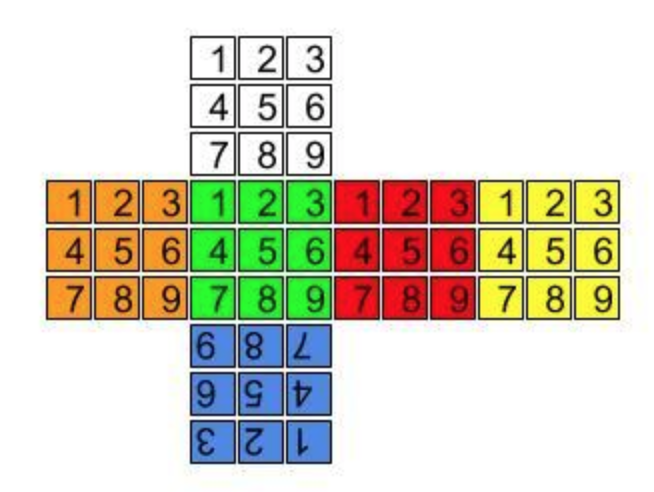

Rubiks Cube
===========

[JL coding challenge 26](https://coding-challenges.jl-engineering.net/challenges/challenge-26/)

------

## Instructions

Each side of a `rubiks cube` is divided into 3 horizontal and vertical layers. 
The cube initially has a different colour on each face with 9 coloured stickers positioned between the horizontal and vertical intersections. 
Layers at the edge of the cube can be rotated by 90 degrees in either direction.




**This challenge is to create a function that creates a `new cube` when a face of the cube is rotated.**

The function receives...
- an array of 6 strings, each representing the stickers on each face of the rubiks cube, 
- a string representing a face to rotate 
- and a string representing the direction to rotate the face. 

**Your function returns an array of 6 strings representing the stickers on each face after a layer has moved.**


The strings in the array are ordered:
- Front
- Back
- Left
- Right
- Top
- Bottom

The colours of each sticker are...
- Green
- Yellow
- Orange
- Red
- White
- Blue

The direction of rotation is either `CW` (clockwise) or `ACW` (anti-clockwise)


For example, a valid function call (in psuedo code) could be:

```kotlin
newCube = rotateCube(["GGGGGGGGG","YYYYYYYYY","OOOOOOOOO","RRRRRRRRR","WWWWWWWWW","BBBBBBBBB"],"Top","CW")
```

In this case the top layer of the Front side moves to the top layer of the Left side, 
which moves to the top layer of the Back side, 
which moves to the top layer of the Right side, 
which moves to the top layer of the Front side.

The top and bottom layers rotate but because they have stickers with all the same colour they remain unchanged. 

So output would be:
```kotlin
["RRRGGGGGG","OOOYYYYYY","GGGOOOOOO","YYYRRRRRR","WWWWWWWWW","BBBBBBBBB"]
```

------

## More Examples

Rotating the bottom clockwise should give:
```kotlin
["GGGGGGOOO","YYYYYYRRR","OOOOOOYYY","RRRRRRGGG","WWWWWWWWW","BBBBBBBBB"]
```

Rotating the left side clockwise should give:
```kotlin
["WGGWGGWGG","YYBYYBYYB","OOOOOOOOO","RRRRRRRRR","YWWYWWYWW","BBGBBGBBG"]
```

Rotating the right side clockwise should give:
```kotlin
["GGBGGBGGB","WYYWYYWYY","OOOOOOOOO","RRRRRRRRR","WWGWWGWWG","YBBYBBYBB"]
```

David Bevan (re above)...
The bottom (last face) is wrong, should be "BBYBBYBBY"
Same for Left CW

------

Rotating the front side clockwise should give:
```kotlin
["GGGGGGGGG","YYYYYYYYY","OOBOOBOOB","WRRWRRWRR","WWWWWWOOO","BBBBBBRRR"]
```

Rotating the back clockwise should give:
```kotlin
["GGGGGGGGG","YYYYYYYYY","WOOWOOWOO","RRBRRBRRB","RRRWWWWWW","OOOBBBBBB"]
```

In the examples above the bottom row of the bottom side is adjacent to the bottom row for the front side. 
The bottom row of the top side is adjacent to the top row of the front side. 
The front, back, left and right are all orientation the same way up.